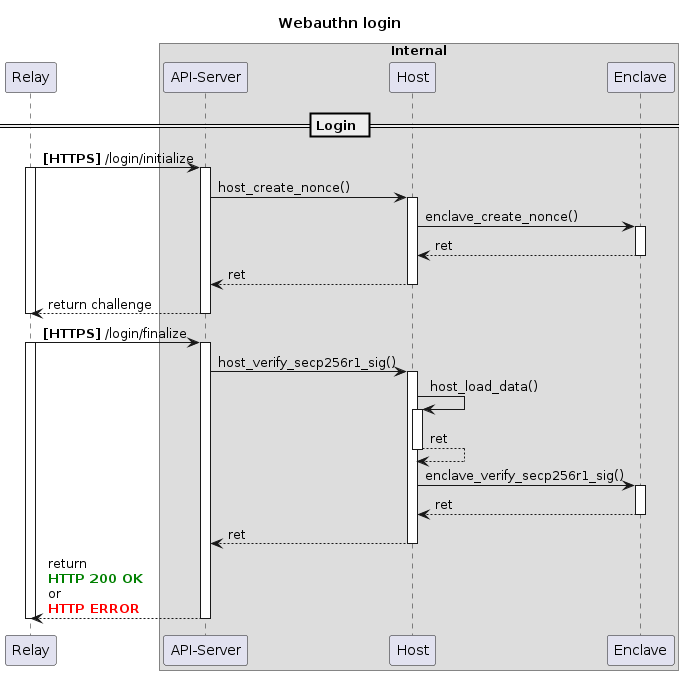
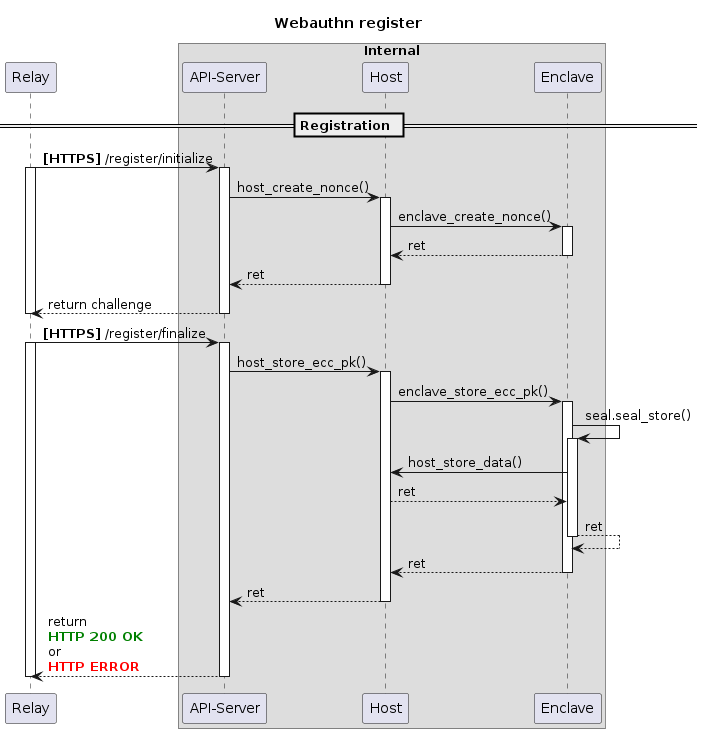
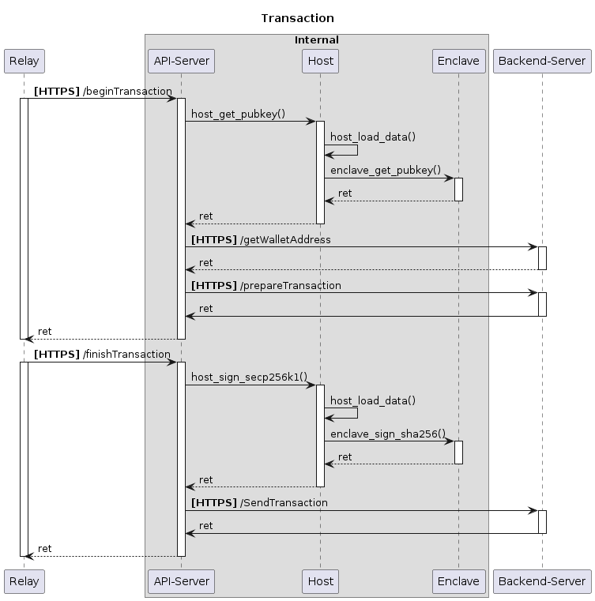

# Introduction
This project consists of
* Frontend
* Relay
* Enclave
* Backend

The relay forwards the request towards the specific enclave. In this case each user has its own enclave. The enclave is the so called Relying Party(RP) which:
* Generates the challenge for the authenticator
* Seals the authenticators public key
* Checks the signature of the responded challenge

Furthermore the enclave generates a *secp256k1* keypair, seals it and stores it onto the disk. This keypair is used to sign all ethereum transactions.

The purpose of the backend is:
* Returning the walletaddress for a given public key
* Preparing a transaction
* Executing a prepared transaction

## Registration
The following sequence diagram visualizes the flow between the internal endpoints.
The registration process involves two requests initiated by the client. The response of the first request is a structure which includes the so called challenge. This challenge is a nonce which is generated by the enclave.

The second request can include a signed challenge. This is specified by the `Attestation Type`. In our implementation we don't require an initial attestation, so that we have to trust the initial transfered public key. If an authenticator like a Yubikey is used, this authenticator could use the certificate issued by Yubico. The RP(Relying Party) could verify the signature of the challenge against Yubicos CA. This is only one possible way. For further informations see: .

## Login
The login is pretty simple from a highlevel perspective. The security is based on hashing, signing, stored credentials and stored nonce(challenge). The client receives a structure which includes the challenge, signs and returns it back to the enclave, which verifies the signature. Under the hood Webauthn does a lot more like:
* Incrementing a counter to prevent replay attacks
* Verifying the nonce against the issued nonce
* Verifying the hash of the payload against the stored hash, to prevent data manipulation.

## Transaction
This implementation of a transaction is **NOT SECURE**. The transactionhash is just appended to the nonce, which is signed by the authenticator. The Webauthn protocol has the ability to send a transaction to the authenticator and let it sign the transaction with the big difference that the transaction is shown to the user through the authenticators display(If it has such a display) or as a popup. Now the user has the opportunity to verify the transaction.

